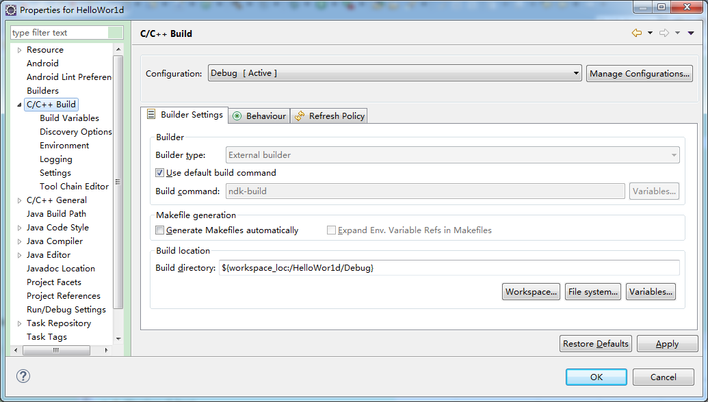

# 说明

这是一个使用ndk显示HelloWorld的Demo。

------------

## 开发环境

我使用的IDE是Eclipse，安卓版本是5.0，我手机的内核是arm的。jdk版本是1.8.0_77。ndk版本是r10b。
在部署环境之前，我们假设你电脑里已经有了ndk，并且安装到了非中文目录中。点击windows - preferences，设置ndk的路径。


## 详细教程

###第一步：新建安卓程序对应安卓版本是默认的我没有修改。


只有一个主类MainActivity，界面也很简单，一个button一个textview，我想实现的就是点击button，textview变成由c传过来的string。
``` java
package com.example.helloworld;

import android.app.Activity;
import android.os.Bundle;
import android.view.View;
import android.widget.Button;
import android.widget.TextView;

public class MainActivity extends Activity {
	Button btn;
	TextView tv;

	@Override
	protected void onCreate(Bundle savedInstanceState) {
		super.onCreate(savedInstanceState);
	     setContentView(R.layout.activity_main);
	     btn = (Button) findViewById(R.id.button);
	     tv = (TextView) findViewById(R.id.text);
	     btn.setOnClickListener(new View.OnClickListener() {

	         @Override
	         public void onClick(View v) {
	             // TODO Auto-generated method stub
	             tv.setText(stringFromJni());
	         }
	     });
	 }
	 private native String stringFromJni();
	
	 static {
	     System.loadLibrary("HelloWorld");
	 }
}
```
代码很短，生命周期函数和findviewbyid就不说了，重点是在private native String stringFromJni();这里声明一个native函数，String类型的，函数内容为空，这个函数的具体实现是在c那边实现的，函数名一定要记住，因为在c那边要与其对应！
static {
	System.loadLibrary("HelloWorld");
}
这句的意思是当调用c的时候，调用的不是你写的.c文件，而是工程目录下的一个叫obj文件夹中的.so类库，这个.so类库的名字就叫System.loadLibrary("");里引号中的，比如这里.so类库名字就叫HelloWorld.so。
最后在点击事件中，setText这个方法的参数就是这个native函数。

###第二步：右键项目名HelloWorld - new - other - Convert to a C/C++ Project(Adds C/C++ Native)-next，选择你的项目HelloWorld，点击finish。这一步是为了给该项目添加c/c++属性，使项目支持c/c++编程。


###第三步：右键项目名HelloWorld - new - Folder新建一个文件夹，起名为jni，右键jni文件夹 - New - File 新建一个文件起名HelloWorld.c。这里如果是用c++写的就起名.cpp，如果是c写的，后缀就是.c，这个文件名字一定要记住！右键jni文件夹 - New - File 新建一个文件起名Android.mk，文件里的内容下面会讲到。


``` C
#include <jni.h>

Java_com_example_helloworld_MainActivity_stringFromJni( JNIEnv* env,
                                                  jobject thiz )
{
    return (*env)->NewStringUTF(env, "Hello from JNI !");
}
```
这是HelloWorld.c文件中的内容，首先要包含头文件jni.h，函数名要和java端的包名类名方法名完全对应，两个参数JNIEnv* env,jobject thiz 是固定写法，这个stringFromJni没有参数，就写这两个参数就可以了。

``` C
LOCAL_PATH := $(call my-dir)

include $(CLEAR_VARS)

LOCAL_MODULE    := HelloWorld
LOCAL_SRC_FILES := HelloWorld.c

include $(BUILD_SHARED_LIBRARY)
```
这是Android.mk文件中的内容，重点是LOCAL_MODULE    := HelloWorld，要和你在java里static函数里指定的.so类库的名称一样，
LOCAL_SRC_FILES := HelloWorld.c这里要和你的jni文件夹下的.c文件的名字一样

###第四步：
在xml布局文件下，是这些内容：
``` xml
<RelativeLayout xmlns:android="http://schemas.android.com/apk/res/android"
    xmlns:tools="http://schemas.android.com/tools"
    android:layout_width="match_parent"
    android:layout_height="match_parent"
    android:paddingBottom="@dimen/activity_vertical_margin"
    android:paddingLeft="@dimen/activity_horizontal_margin"
    android:paddingRight="@dimen/activity_horizontal_margin"
    android:paddingTop="@dimen/activity_vertical_margin"
    tools:context="com.example.helloworld.MainActivity" >

    <TextView
        android:id="@+id/text"  
        android:layout_width="wrap_content"
        android:layout_height="wrap_content"
        android:text="@string/hello_world" />

    <Button   
        android:id="@+id/button"  
        android:layout_width="wrap_content"  
        android:layout_height="wrap_content"
        android:layout_below="@id/text"   
        android:text="@string/str_proc"/> 
        
</RelativeLayout>
```
在string.xml文件中是这样的
``` xml
<?xml version="1.0" encoding="utf-8"?>
<resources>

    <string name="app_name">HelloWor1d</string>
    <string name="hello_world">Hello world!</string>
    <string name="str_proc">button</string>
    <string name="action_settings">Settings</string>

</resources>
```
没什么可讲的，里面就是一个button一个textview。

###第五步
右键项目HelloWorld - Properties - c/c++ Build - Tool Chain Editor，将Current Builder改为Android Builder。然后点击c/c++ build，将Makefile generate 下的 Generate Makefiles automatically的勾去掉。



###第六步
右键项目名HelloWorld - clean project，这时你的工程文件夹下应该就出现了一个obj文件夹，文件夹里有一个文件叫HelloWorld.so，这时编译器通过build你的jni文件夹下的c文件生成的，其实这时候你把jni文件夹删除，这个例程照样能跑，因为运行时候调用的是.so类库，而不是你的jni文件夹下的c文件。这时工程会提示你的项目有错误，错误在HelloWorld.c文件下，你直接把错误删除，运行工程就可以了。

